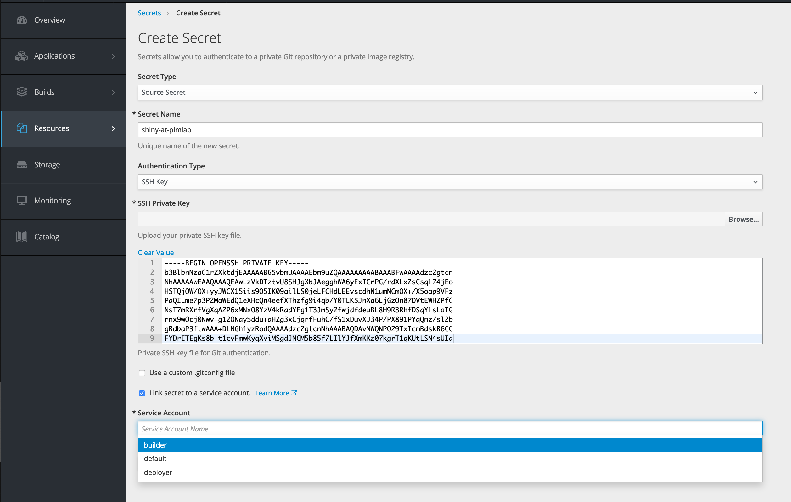

# Serveur ShinyR avec applications personnalisées

- Copiez ce dépôt :
  - git clone plmlab.math.cnrs.fr/plmshift/shiny-custom.git
  - ou bien en cliquant "Fork" sur la page d'accueil de ce dépôt
- Dans le dossier ShinyApps, éditez les fichiers `ui.R` et `server.R`
- Connectez-vous sur https://plmshift.math.cnrs.fr, créez une application Shiny R depuis le catalogue (en choisissant **Shiny R Application Server**)
- Renseignez l'URL de votre dépôt shiny-custom
  - si votre dépôt est public, l'URL sera de la forme : https://plmlab.math.cnrs.fr/votre_groupe/shiny-custom.git
  - si vous souhaitez un dépôt privé, l'URL sera de la forme : [git@plmlab.math.cnrs.fr:votre_groupe/shiny-custom.git](git@plmlab.math.cnrs.fr:votre_groupe/shiny-custom.git)
  - dans le cas d'un dépôt privé, vous devez utiliser une "clé SSH de déploiement" (voir ci-dessous) 
- Patientez et ensuite connectez-vous sur l'URL de votre déploiement
- Le dossier `/opt/app-root/src` est le point de montage d'un volume persistant contenant :
  - le dossier `ShinyApps` : votre application 
  - le dossier `R` vos packages supplémentaires (voir ci-dessous)

# Cycle de vie de votre application

- Editez les fichiers dans le dossier `ShinyApps` de votre dépôt shiny-custom, mettez à jour (git push) le dépôt git
- Relancez la fabrication de votre image... :

### En ligne de commande (avec la commande [oc](https://github.com/openshift/origin/releases/latest) - outil à installer)

- Commencez par vous identifier en executant la commande de login suivante (accessible depuis l'interface web en cliquant sur votre identifient en haut à droite puis sur "Copy Login Command" :
```
oc login https://plmshift.math.cnrs.fr:443 --token=mon_token
```
où mon_token sera une suite de caractère à ne pas divulguée (permettant de ous identifier).

- Executez les commandes suivantes (où mon projet sera à remplacer par le nom de votre projet au sein duquel se trouve votre appli shiny):
```
oc project mon_projet
oc start-build bc/shiny-img
```

### Via la console Web

- Allez sur la console de PLMShift, [sélectionnez votre projet](https://plmshift.math.cnrs.fr/console/projects)
- Onglet Builds->Builds, cliquez sur **shiny-img**
- Cliquez sur **Start Build**

### Installation de packages R supplémentaires

L'installation de packages se fera dans le dossier `/opt/app-root/src/R`.

Il vous suffit de créer un fichier nommé `packages.r` à la racine de votre dépôt contenant les packages à installer (un nom par ligne), comme par exemple :

```
shinydashboard
ggplot2
dplyr
```

Vous pouvez aussi installer des packages en live. Ce n'est pas recommandé car la compilation peut ne pas aboutir si les processus dépassent la mémoire allouée au Pod :

connectez-vous au Pod :
```
oc get pods
oc rsh shiny-2-asce44 (selon ce que donne oc get pods)
```
au prompt du Shell :
```
sh-4.2$ R
> install.packages('mon_package')
> Ctrl D
```

# Récupération depuis PLMShift de votre dépôt privé, via une clé SSH de déploiement

Si votre dépôt Shiny Custom est privé, PLMShift devra posséder un secret (ici une clé SSH) afin d'accéder à votre dépôt

cf: https://docs.openshift.com/container-platform/3.11/dev_guide/builds/build_inputs.html#source-clone-secrets

- Générer la clé :
```
ssh-keygen -C "openshift-source-builder/shiny@plmlab" -f shiny-at-plmlab -N ''
```
- Ajoutez la **clé publique** (contenu du fichier shiny-at-plmlab.pub) dans les préférences du dépôt mon_depot/shiny-custom : **Settings->Repository->Deploy Keys** 
(il est possible de copier la clé publique dans le presse papier à l'aide de la commande suivante : `pbcopy < shiny-at-plmlab.pub`)

### En ligne de commande (avec la commande [oc](https://github.com/openshift/origin/releases/latest))
- Commencez par s'identifier dans oc si ce n'est pas déjà le cas (à l'aide de "Copy Login Command" - voir plus haut) :
```
oc login https://plmshift.math.cnrs.fr:443 --token=mon_token
```
- Ajout de la **clé privé** (contenu du fichier shiny-at-plmlab) dans PLMShift :
```
oc project mon_projet
oc create secret generic shiny-at-plmlab --from-file=ssh-privatekey=shiny-at-plmlab --type=kubernetes.io/ssh-auth
oc set build-secret --source bc/shiny-img shiny-at-plmlab
oc start-build bc/shiny-img
```
La dernière commande ```oc start-build bc/shiny-img``` permet de relancer la fabrication de votre image, la première tentative ayant nécessairement échoué (car la clé SSH n'était pas encore déployée)

### Via la console Web

- Allez sur la console de PLMShift, [sélectionnez votre projet](https://plmshift.math.cnrs.fr/console/projects)
- Onglet Resources->Secrets->Create Secret
  - Pour la rubrique 'Authentication Type' sélectionnez 'SSH Key'
  - Copiez/collez ou téléchargez votre clé privée SSH
  - Pour la rubrique 'Service Account', sélectionnez 'builder'


